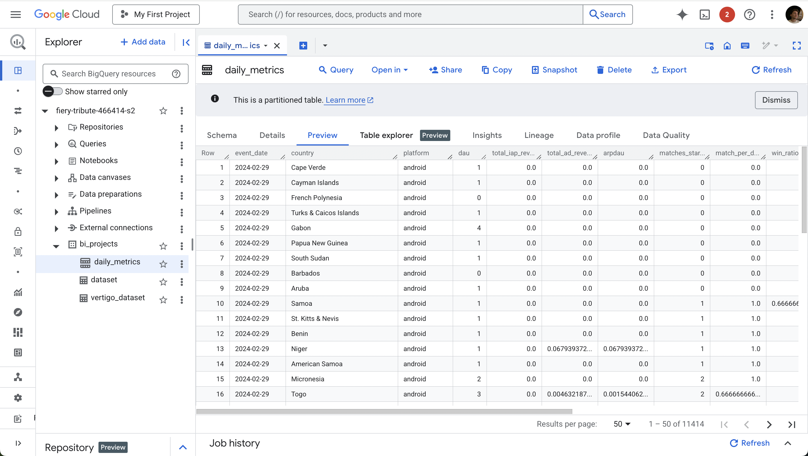

# Daily Metrics DBT Projesi

Kullanıcı seviyesindeki günlük oyun metriklerinden toplanmış günlük metrikleri oluşturan bir DBT projesi.

## Proje Genel Bakış

Bu proje, ham kullanıcı seviyesindeki günlük oyun metriklerini, oyun oynama, para kazanma ve performans sinyallerini gün, ülke ve platform bazında özetleyen toplanmış bir modele dönüştürür.

## Projede Yapılanlar

### 1. Veri Analizi ve Kalite Kontrolü
- Ham veri setindeki anomaliler ve null değerler kontrol edildi
- user_id benzersizliğini gün bazında doğrulandı
- BQ'da Manuel query ile negatif gelir bulunmadığı doğrulandı
- Kritik alanlardaki veri tutarlılığı test edildi

### 2. DAU Hesaplama Yaklaşımı
**Neden session >= 10 veya total_revenue > 0 kullandık:**
- Bu yaklaşım daha güvenilir ve tutarlı DAU metrikleri sağlıyor
- Kullanıcıların aktifliğini ga4 seviyesinde 3 kriterden biri olan session duration ile eşitledik. 
- Günlük aktiflik için günlük total duration modeli kullanıldı.

### 3. Incremental Model Stratejisi
**Neden unique ve son 3 gün stratejisi seçtik:**
- GA4 verilerinden oluşturulduğu varsayıldığı için tam doğru veri için Google 3 günlük delay belirtir
- Geç gelen veri var ise otomatik olarak eski partitionlar güncelliyor
- Unique column ile veri duplikasyonunu önleniyor
- Performans açısından daha verimli

### 4. Temel Metrikler
- **DAU**: Günlük Aktif Kullanıcılar (unique user_id count || IAP + ADR > 0 || daily_session_dur > 10)
- **ARPDAU**: DAU başına ortalama gelir (IAP + Ad revenue / DAU)
- **Match per DAU**: Kullanıcı başına ortalama maç sayısı
- **Win/Defeat Ratio**: Sadece tamamlanan maçlar üzerinden hesaplandı
- **Server Error per DAU**: Platform kararlılığı göstergesi

## Teknik Detaylar

### Gereksinimler
- DBT Core kurulu
- BigQuery dataset erişimi: `fiery-tribute-466414-s2.bi_projects`

### Yapılandırma
`profiles.yml` dosyanızı BigQuery bilgilerinizle güncelleyin:
```yaml
daily_metrics:
  target: dev
  outputs:
    dev:
      type: bigquery
      method: service-account
      project: fiery-tribute-466414-s2
      dataset: bi_projects
      location: US
      keyfile: path/to/service-account.json
```

## Veri Modeli

### Ham Veri (raw_user_daily_metrics)
Her satır bir kullanıcının belirli bir gündeki aktivitesini temsil eder:
- user_id, event_date, install_date
- platform (ANDROID/IOS), country
- Oyun metrikleri: session count/duration, match counts
- Para kazanma: iap_revenue, ad_revenue
- Performans: server_connection_error

### Çıktı Modeli (daily_metrics)
event_date, country, platform bazında toplanmış metrikler:

| Alan | Açıklama |
|------|----------|
| event_date | Aktivite tarihi |
| country | Kullanıcının ülkesi |
| platform | ANDROID/IOS |
| dau | Günlük Aktif Kullanıcılar |
| total_iap_revenue | Toplam IAP geliri |
| total_ad_revenue | Toplam reklam geliri |
| arpdau | DAU başına ortalama gelir |
| matches_started | Başlatılan toplam maç |
| match_per_dau | DAU başına ortalama maç |
| win_ratio | Kazanma oranı (victory/match_end) |
| defeat_ratio | Kaybetme oranı (defeat/match_end) |
| server_error_per_dau | DAU başına sunucu hatası |


## Proje Yapısı

```
.
├── Readme.md
├── dbt_project.yml
├── images
│   └── image.png
├── models
│   ├── daily_metrics.sql
│   └── schema.yml
├── profiles.yml
└── schema.yaml
```

## BQ Ekran Görüntüsü



## Performans Optimizasyonları

### Uygulanmış Optimizasyonlar
- **Partitioning**: event_date'e göre bölümleme
- **Incremental Loading**: Sadece yeni/değişen veriler işleniyor
- **Unique Strategy**: Duplicate verileri otomatik temizleme

## Dashboard ve Görselleştirme

**Dashboard Linki**: [Dashboard'a Git](https://lookerstudio.google.com/u/3/reporting/25c25485-0cc7-4789-a368-344dbb65465a/page/tEnnC/edit)
